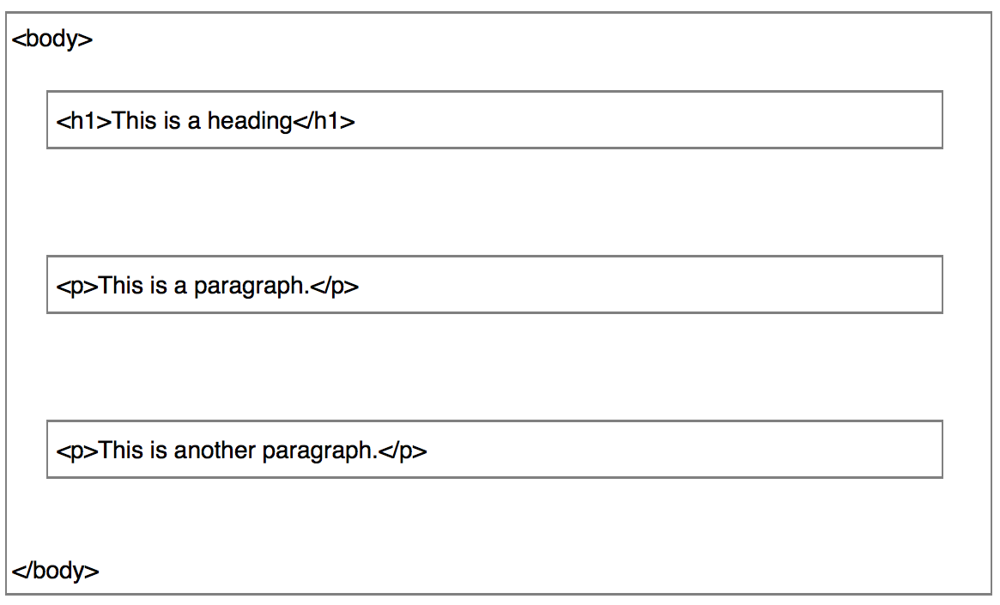
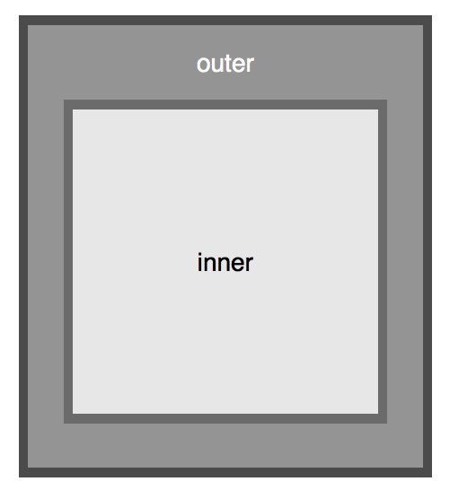
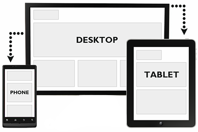
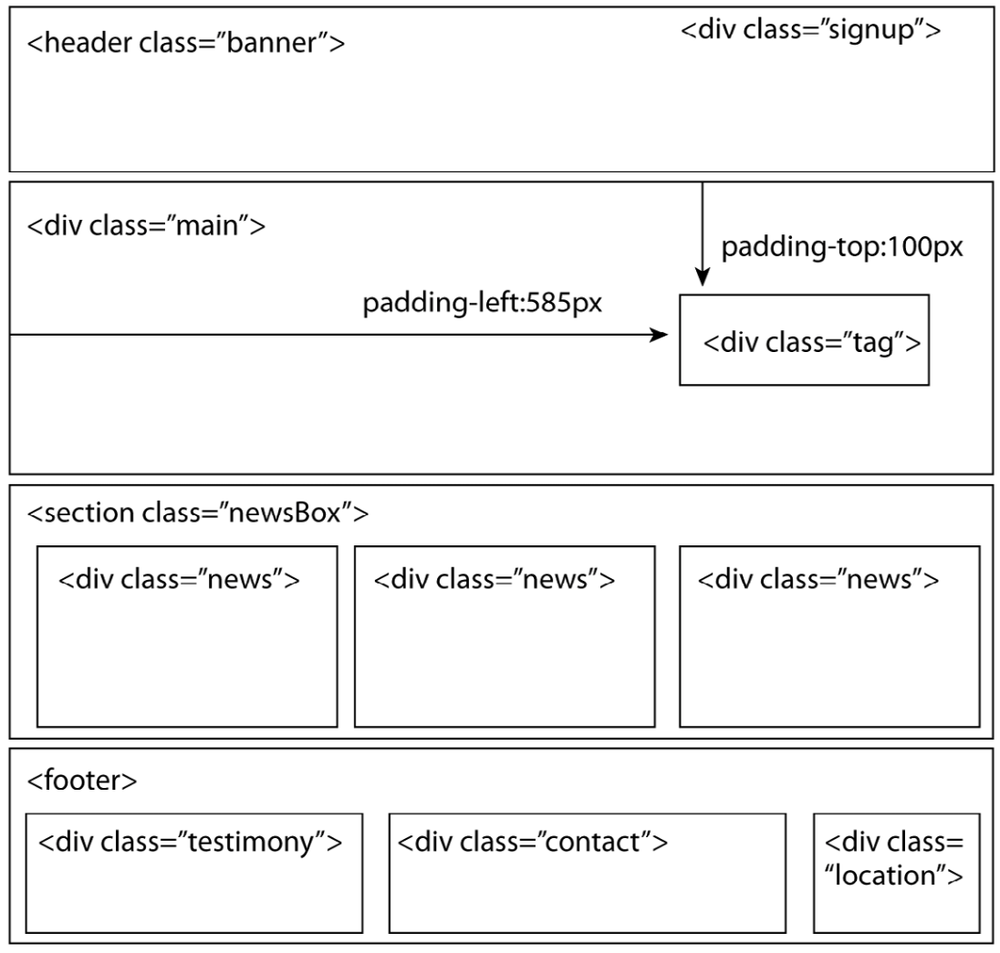
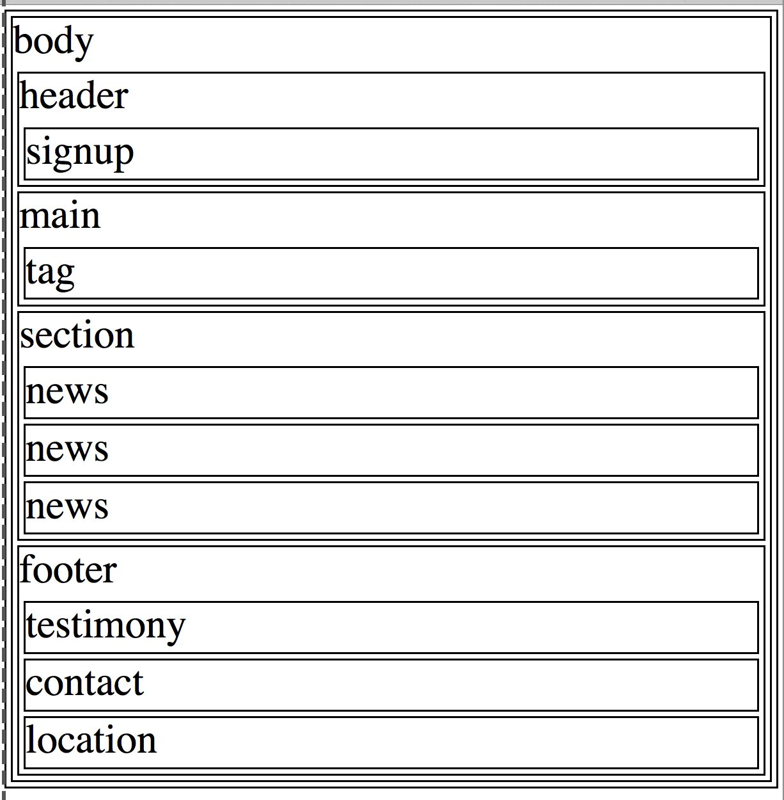
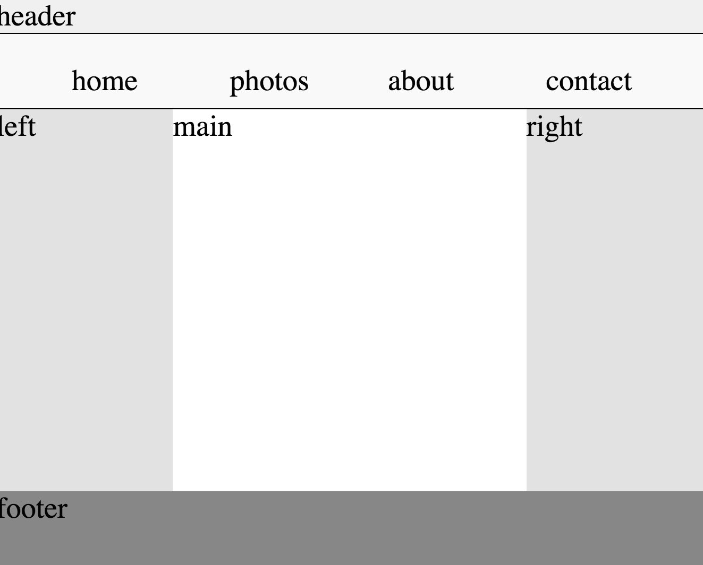

#Geekwise Introduction to `CSS` layouts.
###Tuesday
###Date: 09-08-2015


# 1: Review important concepts from the prior day (Overview)
##CSS - The Box Model

### Proper `CSS` Layouts are about nesting and document structure.

* `HTML`
	* displays content from top to bottom.
	* block elements are stacked on top of each another.

 
* `CSS`
	* block elements can be changed to be viewed as tables,inline and inline-block elements.
	*  columns can be used to position images or text anywhere on the page.
 
```
/*
Change the default structure for the P and SPAN tags
*/

p{
	display:inline
}
span{
	diplay:block
}
```

#`The Box Layout`
---






##`DIV`
```
<div id='outer_box'>
<div id='inner_box'></div>
</div>
```

##`#outer_box`
```

  background-color:#a5a5a5;
    color:#fcfcfc;
    width: 200px;
    border: 5px solid #5d5d5d;
    padding: 10px;
    margin: 10px;
    text-align:center;
    vertical-align:middle;
```

##`#inner_box`
```
	color:black;
	background-color:#ececec;
    height: 150px;
    width: 150px;
    border: 5px solid #7e7e7e;
    padding: 10px;
    margin: 10px;
    line-height:150px;
    text-align:center;
    vertical-align:middle;
```


---


# 2: Share an overview of what will they will learn today

## Two Types Of `CSS` Layouts: _Fixed Width_ And _Liquid_

* Fixed Width layouts are simple to design but at the cost of not being `RESPONSIVE`

* Liquid Layout are designed to be viewed on multiple devices and screens, at the cost of complexity.

### A Liquid Layout That Is Responsive  


##Using A Liquid Layout with `CSS Float`

###Example of using a `CSS Float` inside the `<p>` tag

<p> Lorem ipsum dolor sit amet, consectetur adipiscing elit. Nullam hendrerit euismod lacus, at dictum arcu sagittis eget. Phasellus nec libero dignissim, luctus dui non, sagittis tortor. Nullam tincidunt ante eget bibendum fringilla. Aenean pharetra ultricies ligula,


non ornare justo congue vitae. Duis est arcu, consequat ut volutpat ut, scelerisque id eros. Aliquam erat volutpat. Aenean condimentum maximus risus. Donec imperdiet lacus non nunc commodo, vel pretium nunc iaculis. Sed lacus ex, bibendum eu mauris vel, feugiat feugiat metus. Etiam finibus et tortor nec blandit. Pellentesque vulputate dolor non ipsum pretium tempor. Suspendisse hendrerit sed nibh non finibus.
</p>

----

##CSS is an art and a science.
There is no one formula to follow for marking up your content with `HTML` and styling with `CSS`.

* What works for one design might not for another

* Learning `CSS` is about learning _Styling Strategies_


###It's easy to start with colors, fonts, icons, and images.
* That is the second part (visual design)
* The first part is the structural (content 
* and layout)

##Mobile First
* When designing for a 32-inch flat pannel and a 3 inch phone display, we error on the side of mobile first.

* Estimated over 6 Billion active mobile devices with an internent connection in 2020.

## 3: Practice exercise related to concept and objective

### The Example Liquid Layout Uses The Following `HTML` Tags

* `<header>`
* `<nav>`
* `<div>`
* `<section>`
* `<article>`
* `<footer>`



> Floats should have a width using a percentage

###Step 01


###Step 02



#4: Closing session and circling back to objective of the day

 Using CSS and FLOATS we can create a liquid layout that is viewable on mobile browsers
